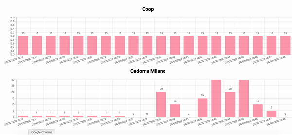

# covid19-people-counter-system
covid19-people-counter-system comes to share queue length to citizens or simply count people outside markets/shop.

This system analize images from city cameras, count people inside them, and show a real-time user interface.\
The software is entirely on-premise so it doesn't need internet access. This is the best way to **guarantee people privacy.**\
City cameras generally already exists or come from new installations by covid emergency.

# Demo UI


# Requirements
Hardware
* cameras with internet access (es. URL/IP)
* server with at least 2G of RAM

Software
* Docker

# Configs steps
* 1. set up cameras urls/ips
* 2. set up environment in docker-compose
* 3. set up environment in Angular UI
* 4. set up DNS
* 5. run it!

# 1. set up cameras urls/ips
`config.json` contains all cameras that covid19-people-counter-system has to contact to get fresh frames.\
Urls can be also IPs.\
* url -> URL or IP of a camera (es. https://someserver.com/mycamera)
* code -> unique code of the camera, it must be lowercase alphanumeric (underscore acceptes) (es. carrefour_1)
* description -> short description of a camera (es. "Carrefour in front of the stadium")

(optional) At runtime the above variables are replaced in "url":
* [YYYY] -> year with century as a decimal number (es. 2020)
* [MM] -> Minute as a decimal number [00,59].
* [DD] -> Day of the month as a decimal number [01,31].
* [HH] -> Hour (24-hour clock) as a decimal number [00,23].
* [mm] -> Month as a decimal number [01,12].

So an url like:

```
[
    {
        "url": "https://someserver.com/YYYY/MM/DD/HH/mm",
        "code": "carrefour_1",
        "description": "Carrefour in front of the stadium"
    }
]
```

at runtime will be `https://someserver.com/2020/03/27/09/10`.\
The timezone is set by TZ env variable of "cron" in docker-compose.

# 2. set up environment in docker-compose

The only variables you need to change are:

* POSTGRES_USER (set a DB username)
* POSTGRES_PASSWORD (set a DB psw)
* TZ: Europe/Rome (set your timezone)
* FREQUENCE_MINUTES [1]
* DOMAIN: test.yuribacciarini.com (your public domain)

[1]
How much you want the data to be fresh?\
FREQUENCE_MINUTES env variable set it.\
For example FREQUENCE_MINUTES=5 says to covid19-people-counter-system to get fresh images every 5 minutes from every images configured in config.json.


3. set up environment in Angular UI

Edit `ui/src/environments/environment.prod.ts`

```
export const environment = {
  production: true,
  codes: ["coop","cadorna"],
  apiHost: "http://localhost",
  locale: "it-CH",
  dateFormat: 'dd/MM/yyyy HH:mm',
  timezone: '+01',
  frequency: 5000
};
```

You need con set only:
* codes: the list of your codes cameras defined in config.json (1. set up cameras urls/ips)
* dateFormat: date format for the charts
* timezone: your timezone
* frequency: refresh frequence

4. set up your DNS\
set up your A Record to point to your server IP

5. run it!\
`docker-compose up -d`

# Todo
* HTTPs support